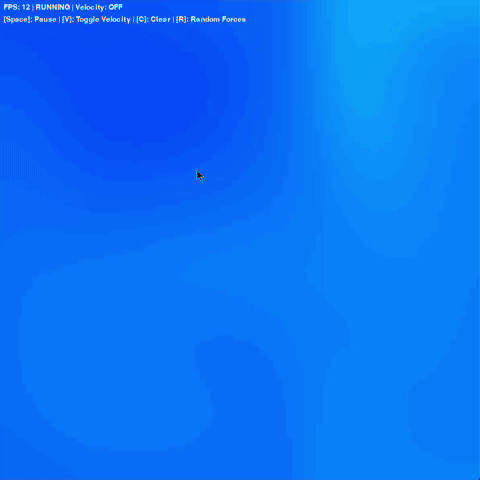
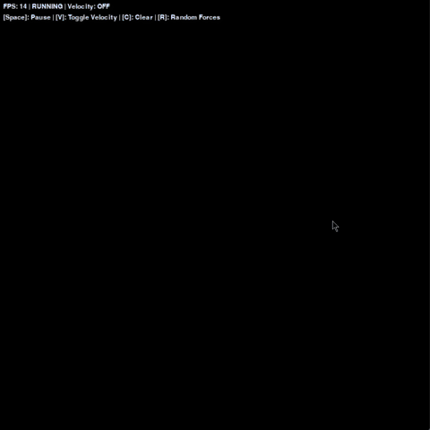

# 🌊 Fluid Dynamics Simulation

[](https://www.python.org/downloads/)
[](https://www.pygame.org/)
[](https://numpy.org/)
[](LICENSE)

A real-time, interactive 2D fluid simulation that visualizes complex fluid dynamics using the Navier-Stokes equations. This physics-based simulation demonstrates computational fluid dynamics principles with an intuitive, visually engaging interface.

<div align="center">
  <div style="display: flex; justify-content: center; gap: 20px; margin-bottom: 10px;">
    <div style="text-align: center;">
      
      <p><strong>Fluid Density Visualization</strong></p>
    </div>
    <div style="text-align: center;">
      
      <p><strong>Velocity Vector Field Visualization</strong></p>
    </div>
  </div>
</div>

## ✨ Features

- **Interactive Fluid Dynamics**: Click and drag to introduce forces and dye into the simulation
- **Real-time Physics**: Accurate numerical approximation of the Navier-Stokes equations
- **Dual Visualization Modes**: View both the fluid density and underlying velocity field
- **Customizable Parameters**: Adjust diffusion, viscosity, and other physical properties
- **Optimized Performance**: Efficiently implemented algorithms for smooth real-time interaction

## 🧪 Mathematical Foundation

The simulation solves the incompressible Navier-Stokes equations:

<div align="center">
  
</div>

Where:
- **u**: Velocity field
- **p**: Pressure
- **ρ**: Density
- **ν**: Viscosity coefficient
- **f**: External forces

With the incompressibility constraint:

<div align="center">
  
</div>

### Navier-Stokes Equations

The simulation solves the incompressible Navier-Stokes equations:

```
∂u/∂t + (u ⋅ ∇)u = -(1/ρ)∇p + ν∇²u + f
```

Where:
- **u**: Velocity field
- **p**: Pressure
- **ρ**: Density
- **ν**: Viscosity coefficient
- **f**: External forces

With the incompressibility constraint:

```
∇ ⋅ u = 0
```

### Prerequisites

```bash
# Install required dependencies
pip install numpy pygame
```

### Running the Simulation

```bash
# Launch the simulation
python fluidsim.py
```

## 🎮 Controls

| Key/Action | Description |
|------------|-------------|
| Mouse Drag | Add fluid density and velocity |
| `Space`    | Pause/Resume simulation |
| `V`        | Toggle velocity visualization |
| `C`        | Clear the simulation |
| `R`        | Add random forces |
| `+`/`-`    | Increase/decrease simulation speed |
| `ESC`      | Exit application |

## 🏗️ Code Architecture

```
fluid-simulation/
├── fluidsim.py         # Main application entry point
├── fluid_simulator.py  # Core fluid dynamics solver
├── visualization.py    # Rendering and visualization components
├── utils/
│   ├── vector_field.py # Vector field operations
│   └── math_utils.py   # Math helper functions
└── tests/              # Test suite
```

### Key Classes

- `FluidSimulator`: Core physics engine implementing Navier-Stokes solver
- `FluidRenderer`: Handles visualization of density and velocity fields
- `SimulationController`: Manages user input and simulation parameters

## 💡 Implementation Details

The implementation follows Jos Stam's "Real-Time Fluid Dynamics for Games" approach with several optimizations:

1. **Velocity Field Update**:
   - Advection → Diffusion → External Forces → Projection

2. **Density Field Update**:
   - Advection → Diffusion → Source Addition

3. **Projection Method**:
   - Computes pressure to ensure mass conservation
   - Uses multi-grid or conjugate gradient methods for efficiency

## 🔧 Customization

The simulation offers various parameters for experimentation:

```python
# Example configuration
config = {
    'grid_size': 128,
    'diffusion_rate': 0.0001,
    'viscosity': 0.00001,
    'dt': 0.1,
    'iterations': 20
}
```

## 🔮 Future Enhancements

- [ ] GPU acceleration using OpenCL/CUDA
- [ ] 3D fluid simulation
- [ ] Interaction with rigid bodies
- [ ] Advanced rendering with particle systems
- [ ] Web-based version using WebGL

## 📚 Resources

- [Real-Time Fluid Dynamics for Games](https://www.dgp.toronto.edu/public_user/stam/reality/Research/pdf/GDC03.pdf) by Jos Stam
- [Fluid Simulation for Computer Graphics](https://www.cs.ubc.ca/~rbridson/fluidsimulation/) by Robert Bridson
- [Physically Based Modeling: Principles and Practice](http://www.cs.cmu.edu/~baraff/sigcourse/) by Andrew Witkin and David Baraff

## 📄 License

This project is licensed under the MIT License - see the [LICENSE](LICENSE) file for details.

---

<div align="center">
  <p>
    <i>Developed with ❤️ and a passion for computational physics</i>
  </p>
</div>
